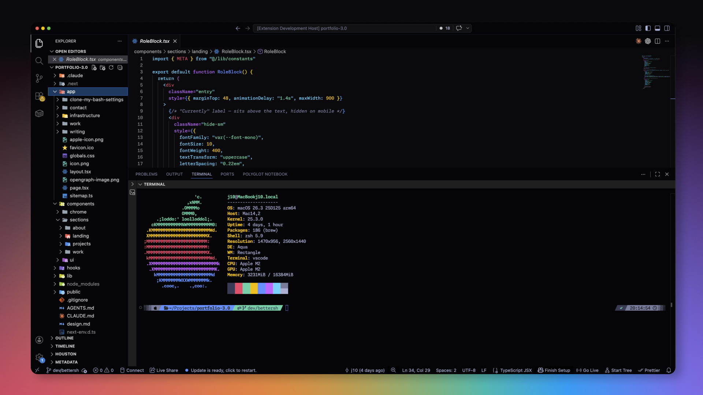

# Tokyo Midnight Saturated

A hyper-saturated, high-contrast, and deeply dark twist on the beautiful Tokyo Night theme. Built for late-night coding with vivid syntax highlighting and a seamless, flat UI.

## Screenshots

## Installation

1. Open the **Extensions** sidebar in VS Code.
2. Search for `Tokyo Midnight Saturated`.
3. Click **Install**.
4. Go to `Preferences: Color Theme` (`Cmd/Ctrl + K`, `Cmd/Ctrl + T`) and select **Tokyo Midnight Saturated**.

## Credits

**Created by:** Jason Tenczar  
*Inspired by the original [Tokyo Night](https://marketplace.visualstudio.com/items?itemName=enkia.tokyo-night) theme by enkia.*